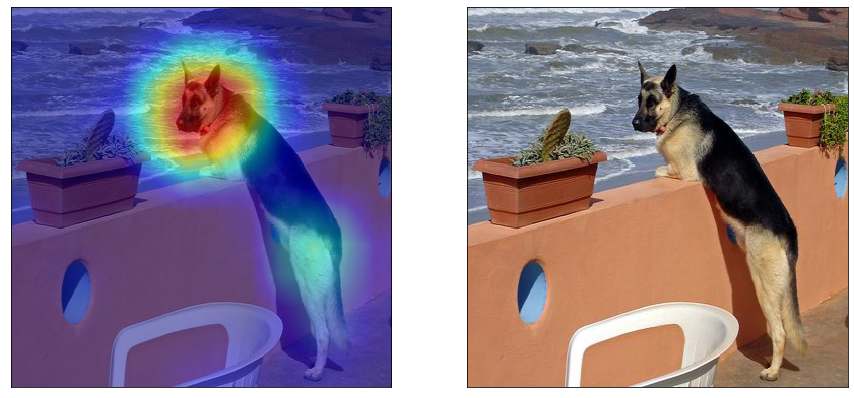

# Grad-CAM Implmentation

PyTorch Implmentation of Grad-CAM. 
Grad-CAM is a technique to generate visual explaination of the result of a Convolutional Neural Net.

### Files
- `gradcam.py` contains the codebase for the Grad-CAM method. The *GradCam* class expects a *model* and its *layer* as input.
- `test.py` is a sample script to generate gradcam output.

### **Sample Output**

Above Implmentation test uses Resnet101 model. But any model can be used to generate output.

---

See the Paper: [Ramprasaath R. Selvaraju, Michael Cogswell, Abhishek Das, Ramakrishna Vedantam, Devi Parikh, Dhruv Batra; Grad-CAM: Visual Explanations From Deep Networks via Gradient-Based Localization](https://arxiv.org/pdf/1610.02391.pdf).

The paper authors' torch implementation: [ramprs/grad-cam](https://github.com/ramprs/grad-cam).
